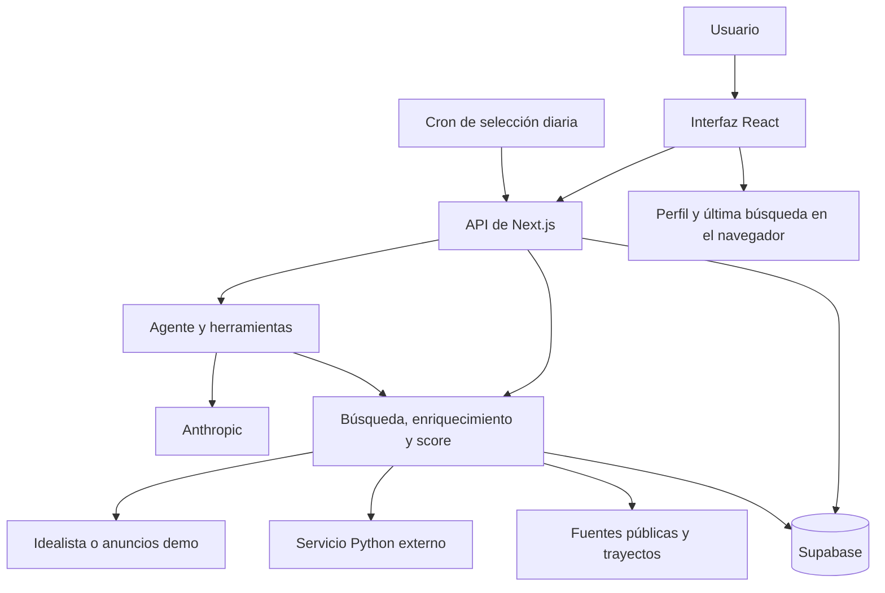

# Arquitectura de la aplicación

[Volver al README](../README.md)

HabitIA es una aplicación Next.js con interfaz React y API de servidor en el mismo repositorio. El modelo de valoración es un servicio HTTP externo. Las credenciales de proveedores se utilizan en el servidor.

## Responsabilidades

| Área | Código | Responsabilidad |
| --- | --- | --- |
| Páginas y API | `app/` | Navegación, entradas HTTP y respuestas |
| Interfaz | `components/`, `hooks/` | Presentación, interacción y estado del navegador |
| Recomendación | `lib/recommend.ts`, `lib/enrich.ts` | Buscar candidatos, enriquecer y ordenar |
| Score | `lib/personal-score.ts` | Pesos, evidencias disponibles y filtros obligatorios |
| Agente | `lib/agent/` | Prompt, ejecución de herramientas y conversación |
| Proveedores | `lib/idealista/`, `lib/commute/`, `lib/market/` | Adaptación, caché y procedencia de datos |
| Modelo externo | `lib/valoracion/` | Contratos XGBoost v3 y LightGBM v2; estados por anuncio |
| Persistencia | `lib/supabase/`, `lib/shared-demo.ts` | API de demo compartida y cliente del navegador |
| Finanzas | `lib/finance/` | Cálculo determinista de compra frente a alquiler |
| Contexto estático | `data/madrid/` | Instantáneas oficiales consumidas por `/datos` y `/como-funciona` |

`app/` conserva las convenciones de Next.js. Los componentes están agrupados por función y mantienen su CSS junto al archivo que lo utiliza. Las importaciones entre áreas utilizan `@/`, que apunta a la raíz del repositorio.

## De una búsqueda a una recomendación

1. El usuario completa su perfil y confirma la búsqueda en el panel.
2. `/api/recommend` valida el cuerpo, la confirmación y el límite de solicitudes.
3. `recommend` obtiene anuncios sintéticos o consulta la caché/API de Idealista. Una consulta nueva real requiere reserva SQL.
4. Los filtros excluyen requisitos explícitamente incumplidos. Las características desconocidas conservan su estado.
5. `enrichProperties` solicita valoración, contexto y trayecto según la información disponible.
6. `personalScore` calcula aportaciones y cobertura; el recomendador ordena los candidatos.
7. La interfaz muestra tarjetas y mapa. Restaurar la última búsqueda o reordenar resultados no consulta Idealista de nuevo.

El chat accede a la misma lógica mediante herramientas: búsqueda, detalle, valoración, hipoteca, mercado, alquiler, trayecto, barrio y comparación de compra/alquiler. Devuelve eventos mediante Server-Sent Events (SSE). El cliente guarda la conversación al terminar o detener la respuesta; el stream no se graba continuamente en SQL.

## HabitIA Score

Los pesos son enteros, suman 100 y empiezan en 25 por componente.

| Componente | Qué representa | Disponibilidad |
| --- | --- | --- |
| Fair | Comparación del precio del anuncio con un escenario individual válido del modelo | Requiere valoración compatible |
| Opportunity | Revalorización relativa de la zona frente a la ciudad | Sin evidencia verificable integrada |
| Zone | Indicadores del entorno | Metodología prevista de cinco componentes con igual peso; pendiente de implementación y datos comparables por distrito |
| Lifestyle | Tiempo de trayecto al trabajo | Requiere perfil y trayecto |

Cada aportación es `peso × valor / 100`. Un dato ausente aporta cero y su peso no se redistribuye. La cobertura indica cuánto de las prioridades puede evaluarse. Una referencia provincial o un recuento urbano no sustituye una valoración individual ni un índice de barrio.

La [metodología prevista de Zone](datos.md#metodología-prevista-de-zone-score) documenta la fórmula, los datos disponibles y las decisiones pendientes. No modifica el cálculo actual: Zone permanece en `null`.

## Persistencia e identidad

- **Navegador:** perfil, última búsqueda y preferencias de interfaz.
- **Demo compartida:** conversaciones, mensajes y favoritos visibles para todos los visitantes. Las API acceden a tablas `demo_*` con la clave de servidor y RLS activado; no hay acceso SQL público.
- **Notificaciones:** identidad aleatoria en cookie HttpOnly y hash en el servidor. La bandeja se filtra por esa identidad.
- **Infraestructura:** caché de mercado, caché de búsquedas y reservas de cuota.

El historial lista las últimas 50 conversaciones y hasta 200 mensajes por conversación; los favoritos, hasta 100. La interfaz actualiza listas cada 30 segundos y al recuperar el foco. Los errores de Supabase se muestran al usuario; no se simula un guardado correcto en otra ubicación.

## API de la aplicación

| Ruta | Métodos | Función |
| --- | --- | --- |
| `/api/chat` | POST | Conversación SSE con herramientas |
| `/api/recommend` | POST | Búsqueda confirmada; exige `confirmSearch: true` |
| `/api/enrich` | POST | Enriquecer anuncios existentes |
| `/api/property` | GET | Detalle de un anuncio |
| `/api/geocode` | GET | Geocodificación directa e inversa |
| `/api/valoracion` | GET, POST | Estado del servicio y valoración de hasta 24 anuncios |
| `/api/idealista-usage` | GET | Estado de la cuota y del modo demo |
| `/api/conversations` | GET, POST | Historial compartido y guardado |
| `/api/favorites` | GET, POST, DELETE | Favoritos compartidos |
| `/api/notifications` | GET, PUT, PATCH | Configuración y bandeja por navegador |
| `/api/cron/market` | GET | Actualizar caché de mercado |
| `/api/cron/recommendations` | GET | Procesar una suscripción pendiente |

Los cuerpos y validaciones concretos están en los correspondientes `route.ts` y en `types/index.ts`. Las API pertenecen al prototipo web; no se presentan como un servicio público independiente con cuentas o SLA.

## Ámbito geográfico de búsqueda

La versión actual busca viviendas en Madrid capital. `search-location.ts` valida texto, centro y radio antes de acceder a la caché, autenticación o cuota de Idealista, también en modo demo. No se admiten `locationId` opacos. `search-scope.ts` comprueba el límite derivado de los 131 barrios del paquete XGBoost y filtra los anuncios retornados por radios que cruzan el municipio, incluidas respuestas guardadas en caché.

El inicio y el selector de vivienda usan `/api/geocode?scope=madrid`; los puntos del mapa se comprueban igualmente. La geocodificación general se conserva para el origen del trayecto. Las sugerencias y el prompt del agente explican Madrid capital; los perfiles antiguos fuera de ámbito deben corregirse antes de buscar.
